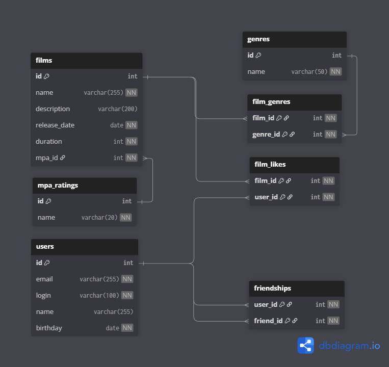

# 🎥 Filmorate

**Filmorate** — REST API сервис для работы с фильмами и пользователями.
Приложение позволяет хранить фильмы, управлять пользователями, формировать список друзей, ставить лайки фильмам и получать подборку самых популярных фильмов.

Проект реализован на **Java 21**, **Spring Boot**, **Spring JDBC** и **H2 Database**.

---

## Возможности

- создание, обновление и получение пользователей;
- создание, обновление и получение фильмов;
- добавление и удаление друзей;
- получение списка друзей пользователя;
- получение списка общих друзей двух пользователей;
- добавление и удаление лайков фильмам;
- получение списка популярных фильмов по количеству лайков;
- получение справочников жанров и рейтингов MPA;
- валидация входящих данных через Bean Validation и сервисный слой;
- централизованная обработка ошибок;
- JDBC-слой с SQL-схемой и начальными данными.

---

## Технологии

- **Java 21**
- **Spring Boot 3.2.4**
- **Spring Web**
- **Spring JDBC**
- **Spring Validation**
- **H2 Database**
- **Lombok**
- **JUnit 5 / Spring Boot Test / MockMvc**
- **Logbook** для HTTP-логирования
- **GitHub Actions** для API-проверок на Pull Request

---

## Архитектура проекта

Проект построен по классической слоистой схеме:

### 1. Controller
REST-контроллеры принимают HTTP-запросы и делегируют работу сервисам:

- `FilmController`
- `UserController`
- `GenreController`
- `MpaController`

### 2. Service
Сервисный слой содержит бизнес-логику:

- проверка существования пользователей, фильмов, жанров и рейтингов MPA;
- дополнительная валидация правил домена;
- работа с лайками и дружбой;
- сборка конечных моделей фильмов с жанрами и лайками.

### 3. Storage
Слой доступа к данным реализован через `JdbcTemplate`:

- `FilmDbStorage`
- `UserDbStorage`
- `FriendshipDbStorage`
- `GenreDbStorage`
- `MpaDbStorage`

### 4. Model
Основные сущности проекта:

- `Film`
- `User`
- `Genre`
- `MpaRating`

### 5. Exception Handling
Глобальный обработчик `ErrorHandler` возвращает понятные HTTP-ошибки:

- `400 Bad Request`
- `404 Not Found`
- `500 Internal Server Error`

---

## Структура проекта

```text
src/
 ├── main/
 │   ├── java/ru/yandex/practicum/filmorate/
 │   │   ├── controller
 │   │   ├── exception
 │   │   ├── mapper
 │   │   ├── model
 │   │   ├── service
 │   │   └── storage
 │   └── resources/
 │       ├── application.properties
 │       ├── schema.sql
 │       └── data.sql
 └── test/
     └── java/ru/yandex/practicum/filmorate/
         ├── dao
         └── validation
```

---

## База данных

При запуске приложения автоматически инициализируются:

- схема БД из `schema.sql`;
- тестовые справочники из `data.sql`.

### Основные таблицы

- `users` — пользователи;
- `films` — фильмы;
- `mpa_ratings` — возрастные рейтинги;
- `genres` — жанры;
- `friendships` — связи дружбы между пользователями;
- `film_likes` — лайки фильмов;
- `film_genres` — связь фильмов и жанров.

### ER-диаграмма

В репозитории уже есть схема базы данных:



---

## Предзаполненные данные

При старте в БД добавляются рейтинги MPA:

- `G`
- `PG`
- `PG-13`
- `R`
- `NC-17`

И жанры:

- Комедия
- Драма
- Мультфильм
- Триллер
- Документальный
- Боевик

---

## Конфигурация

Файл: `src/main/resources/application.properties`

```properties
spring.sql.init.mode=always

spring.datasource.url=jdbc:h2:file:./db/filmorate
spring.datasource.driverClassName=org.h2.Driver
spring.datasource.username=sa
spring.datasource.password=password

spring.h2.console.enabled=true
spring.h2.console.path=/h2
```

### Что это означает

- используется файловая база H2;
- данные сохраняются локально в директорию `./db/filmorate`;
- SQL-скрипты выполняются автоматически при запуске;
- H2 Console доступна по адресу `http://localhost:8080/h2`.

---

## Требования для запуска

- **Java 21**
- **Maven 3.9+**

Проверка версий:

```bash
java -version
mvn -version
```

---

## Запуск проекта

### 1. Клонировать репозиторий

```bash
git clone <URL_ВАШЕГО_РЕПОЗИТОРИЯ>
cd java-filmorate-main
```

### 2. Запустить приложение

```bash
mvn spring-boot:run
```

или

```bash
mvn clean package
java -jar target/filmorate-0.0.1-SNAPSHOT.jar
```

После запуска сервис будет доступен по адресу:

```text
http://localhost:8080
```

---

## Основные REST эндпоинты

## Пользователи

### Создать пользователя

```http
POST /users
```

Пример тела запроса:

```json
{
  "email": "user@mail.com",
  "login": "user-login",
  "name": "User Name",
  "birthday": "1995-05-15"
}
```

### Обновить пользователя

```http
PUT /users
```

### Получить всех пользователей

```http
GET /users
```

### Получить пользователя по id

```http
GET /users/{id}
```

### Добавить в друзья

```http
PUT /users/{id}/friends/{friendId}
```

### Удалить из друзей

```http
DELETE /users/{id}/friends/{friendId}
```

### Получить друзей пользователя

```http
GET /users/{id}/friends
```

### Получить общих друзей

```http
GET /users/{id}/friends/common/{otherId}
```

---

## Фильмы

### Создать фильм

```http
POST /films
```

Пример тела запроса:

```json
{
  "name": "Interstellar",
  "description": "Science fiction film",
  "releaseDate": "2014-11-07",
  "duration": 169,
  "mpa": {
    "id": 3
  },
  "genres": [
    { "id": 2 },
    { "id": 6 }
  ]
}
```

### Обновить фильм

```http
PUT /films
```

### Получить все фильмы

```http
GET /films
```

### Получить фильм по id

```http
GET /films/{id}
```

### Поставить лайк фильму

```http
PUT /films/{id}/like/{userId}
```

### Удалить лайк

```http
DELETE /films/{id}/like/{userId}
```

### Получить популярные фильмы

```http
GET /films/popular?count=10
```

---

## Справочники

### Все жанры

```http
GET /genres
```

### Жанр по id

```http
GET /genres/{id}
```

### Все рейтинги MPA

```http
GET /mpa
```

### Рейтинг MPA по id

```http
GET /mpa/{id}
```

---

## Правила валидации

### Для пользователя

- `email` должен быть валидным email-адресом;
- `email` не может быть пустым;
- `login` не может быть пустым;
- `login` не может содержать пробелы;
- `birthday` не может быть датой из будущего.

### Для фильма

- `name` не может быть пустым;
- `description` не длиннее 200 символов;
- `releaseDate` должна быть не раньше **28.12.1895**;
- `duration` должна быть положительной;
- `mpa` обязателен;
- указанные жанры должны существовать в справочнике.

### Дополнительная бизнес-валидация

Сервисный слой также проверяет:

- существование фильма перед обновлением;
- существование пользователя перед добавлением в друзья;
- существование фильма и пользователя перед постановкой лайка;
- существование MPA рейтинга;
- корректность списка жанров.

---

## Особенности реализации

### Популярные фильмы

Популярность вычисляется по количеству лайков:

- данные берутся из таблицы `film_likes`;
- фильмы сортируются по `COUNT(likes)` по убыванию;
- количество фильмов регулируется параметром `count`.

### Жанры фильма

Для фильма поддерживается набор жанров:

- жанры хранятся в таблице `film_genres`;
- при чтении фильма жанры сортируются по `id`;
- дубликаты жанров отфильтровываются.

### Дружба

Связи друзей реализованы через таблицу `friendships`.
Поддерживаются:

- добавление друга;
- удаление друга;
- просмотр списка друзей;
- поиск общих друзей двух пользователей.

---

## Тестирование

В проекте уже есть тесты двух уровней:

### 1. DAO / JDBC тесты
Проверяют работу слоя хранения:

- `FilmDbStorageTest`
- `UserDbStorageTest`
- `GenreDbStorageTest`
- `MpaDbStorageTest`

### 2. Validation / Controller тесты
Проверяют корректность HTTP-валидации через `MockMvc`:

- `FilmValidationControllerTest`
- `UserValidationControllerTest`

### Запуск тестов

```bash
mvn test
```

---

## CI

В репозитории настроен GitHub Actions workflow:

```text
.github/workflows/api-tests.yml
```

Проверки запускаются на **pull request** и используют внешний reusable workflow Praktikum для API-тестов.

---

## Примеры SQL-запросов

### Получить все фильмы

```sql
SELECT *
FROM films;
```

### Получить топ-10 фильмов по лайкам

```sql
SELECT film_id,
       COUNT(user_id) AS likes
FROM film_likes
GROUP BY film_id
ORDER BY likes DESC
LIMIT 10;
```

### Получить жанры фильма

```sql
SELECT g.*
FROM film_genres fg
JOIN genres g ON fg.genre_id = g.id
WHERE fg.film_id = ?
ORDER BY g.id;
```

### Получить общих друзей двух пользователей

```sql
SELECT f1.friend_id
FROM friendships f1
JOIN friendships f2 ON f1.friend_id = f2.friend_id
WHERE f1.user_id = ?
  AND f2.user_id = ?;
```

---

## Что можно улучшить дальше

- добавить Swagger / OpenAPI документацию;
- вынести конфигурацию БД в переменные окружения;
- добавить Dockerfile и docker-compose;
- перейти с H2 на PostgreSQL для production-сценария;
- реализовать пагинацию и расширенную фильтрацию;
- добавить интеграционные тесты полного API-потока;
- расширить модель рекомендациями и поиском по фильмам.

---

## Статус

Проект представляет собой учебный backend-сервис для практики:

- REST API;
- SQL-модели и JDBC;
- валидации;
- тестирования;
- слоистой архитектуры Spring Boot-приложения.

Подходит как база для дальнейшего расширения в полноценную систему рекомендаций и социальной платформы для оценки фильмов.
